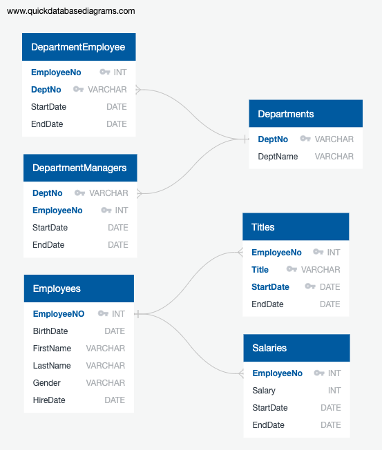
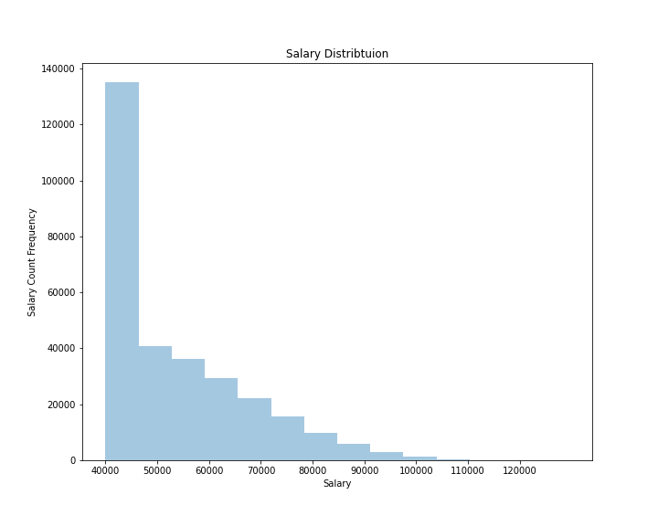
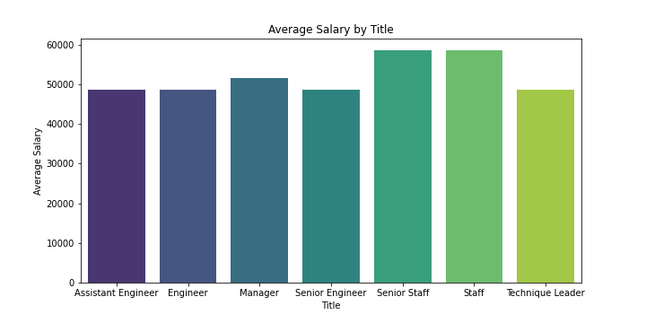

# SQL Employee Database Project


## Background

This project's intent is to take a batch of csv's containing information on a compnay's employees and bring them into a SQL database for ease of querying. The project scope involves three main tasks: Data Modeling, Data Engineering, and Data Analysis

1. Data Modeling: Inspect the CSVs and sketch a database design for the tables

2. Data Engineering: Create a table schema for each of the six CSV tables. Create the tables in PostgreSQL.

3. Data Analysis: Answer the provided research questions.

**Tools Used:** PostgreSQL, Python, MatplotLib, Excel


#### Data Modeling



Database ERD diagram was created using .[http://www.quickdatabasediagrams.com](http://www.quickdatabasediagrams.com)
The modeling process is an intuitive process that helps us gain a better understanding of our database. In this step we identify primary and foreign keys, define datatypes, and determine relationships. For some tables, like with the *Employees* and *Departments* tables, this is simple since each record is unique and has a numeric ID. For other it is more nuanced and requires the creation of composite keys. 


#### Data Engineering

With our diagram complete we can move on the creating the tables in PostgreSQL. In the user interface, we design queries that follow a general structure: 
```
CREATE TABLE employees(
	employee_no INT PRIMARY KEY,
	birth_date DATE,
	first_name VARCHAR(255),
	last_name VARCHAR(255),
	gender VARCHAR(255),
	hire_date DATE
);
```
With our tables created we can import the csv data.

#### Data Analysis

Research Questions:

1. List the following details of each employee: employee number, last name, first name, gender, and salary.
```
SELECT employees.employee_no, employees.last_name, employees.first_name, employees.gender, salaries.salary
FROM employees INNER JOIN salaries ON 
employees.employee_no=salaries.employee_no;
```
2. List employees who were hired in 1986.
```
SELECT first_name, last_name, hire_date
FROM employees
WHERE EXTRACT(YEAR FROM hire_date) = 1986
```
3. List the manager of each department with the following information: department number, department name, the manager's employee number, last name, first name, and start and end employment dates.
```
SELECT deptmanagers.dept_no, departments.dept_name, deptmanagers.employee_no, employees.last_name, employees.first_name, deptmanagers.start_date, deptmanagers.end_date
FROM deptmanagers LEFT JOIN departments ON
deptmanagers.dept_no=departments.dept_no INNER JOIN employees ON
deptmanagers.employee_no=employees.employee_no;
```
4. List the department of each employee with the following information: employee number, last name, first name, and department name.
```
SELECT deptemployees.employee_no, employees.last_name, employees.first_name, departments.dept_name
FROM deptemployees LEFT JOIN departments ON
deptemployees.dept_no=departments.dept_no INNER JOIN employees ON
deptemployees.employee_no=employees.employee_no;
```
5. List all employees whose first name is "Hercules" and last names begin with "B."
```
SELECT first_name, last_name
FROM employees
WHERE first_name = 'Hercules' AND last_name LIKE 'B%'
```
6. List all employees in the Sales department, including their employee number, last name, first name, and department name.
```
SELECT deptemployees.employee_no, employees.last_name, employees.first_name, departments.dept_name
FROM deptemployees LEFT JOIN departments ON
deptemployees.dept_no=departments.dept_no INNER JOIN employees ON
deptemployees.employee_no=employees.employee_no
WHERE dept_name = 'Sales'
```
7. List all employees in the Sales and Development departments, including their employee number, last name, first name, and department name.
```
SELECT deptemployees.employee_no, employees.last_name, employees.first_name, departments.dept_name
FROM deptemployees LEFT JOIN departments ON
deptemployees.dept_no=departments.dept_no INNER JOIN employees ON
deptemployees.employee_no=employees.employee_no
WHERE dept_name IN ('Sales','Development')
```
8. In descending order, list the frequency count of employee last names, i.e., how many employees share each last name.
```
SELECT last_name, COUNT(last_name) AS "name count"
FROM employees
GROUP BY last_name
ORDER BY "name count" DESC;
```
## Bonus (Optional)

As you examine the data, you are overcome with a creeping suspicion that the dataset is fake. You surmise that your boss handed you spurious data in order to test the data engineering skills of a new employee. To confirm your hunch, you decide to take the following steps to generate a visualization of the data, with which you will confront your boss:

1. Import the SQL database into Pandas. (Yes, you could read the CSVs directly in Pandas, but you are, after all, trying to prove your technical mettle.) This step may require some research. Feel free to use the code below to get started. Be sure to make any necessary modifications for your username, password, host, port, and database name:

   ```sql
   from sqlalchemy import create_engine
   engine = create_engine('postgresql://localhost:5432/<your_db_name>')
   connection = engine.connect()
   ```

* Consult [SQLAlchemy documentation](https://docs.sqlalchemy.org/en/latest/core/engines.html#postgresql) for more information.

* If using a password, do not upload your password to your GitHub repository. See [https://www.youtube.com/watch?v=2uaTPmNvH0I](https://www.youtube.com/watch?v=2uaTPmNvH0I) and [https://martin-thoma.com/configuration-files-in-python/](https://martin-thoma.com/configuration-files-in-python/) for more information.

2. Create a histogram to visualize the most common salary ranges for employees.



From the histogram we can see that the majority of salaries have fallen into the $40,000 - $45,000 range. The upper bound for all salaries seems to be around $120,000.

3. Create a bar chart of average salary by title.



Looking at average salary by title we see an even distribution that hovers around $50,000 for all titles except for *senior staff* and *staff* who are closer to $60,000

### Copyright

Trilogy Education Services © 2019. All Rights Reserved.
